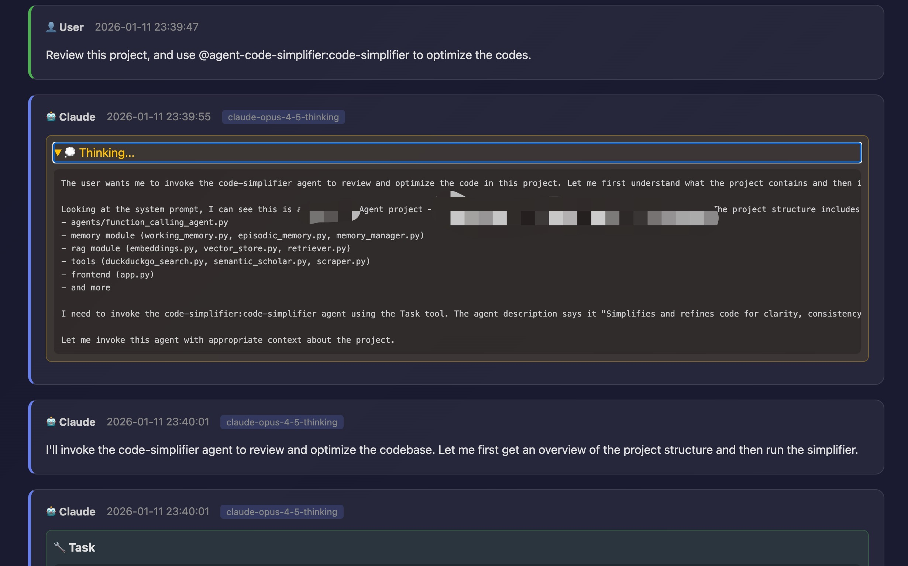

<div align="left">
  <a href="README_CN.md">中文</a> | <strong>English</strong>
</div>

# Claude Code History Viewer

A simple web application to view conversation history from Claude Code.

## Features

- 📁 Browse all Claude Code projects
- 💬 View conversation history in projects
- 🎨 Modern web interface
- 🔍 Support for viewing complete message content, including thinking processes and tool calls
- 🚀 Automatic port detection, automatically uses other available ports if the default port is occupied

## Requirements

- Python 3.6 or higher
- Claude Code installed with conversation history generated

## Installation

### Install via pip (Recommended)

The easiest way to install is using pip:

```bash
pip install claude-code-history
```

Or install from source:

```bash
pip install git+https://github.com/chenwei-zhang/claude-code-history.git
```

### Install from source

1. Clone or download this project:
   ```bash
   git clone https://github.com/chenwei-zhang/claude-code-history.git
   cd claude-code-history
   ```

2. Install the package:
   ```bash
   pip install .
   ```

3. Ensure Python 3.6+ is installed:
   ```bash
   python3 --version
   ```

The project uses Python standard library, no additional dependencies required.

## Usage

After installation, you can run the application using the `claude-code-history` command:

1. Run the application:
   
   Use default port 8000:
   ```bash
   claude-code-history
   ```
   
   Or specify a custom port:
   ```bash
   claude-code-history --port 8080
   ```
   
   Or use the short form:
   ```bash
   claude-code-history -p 8080
   ```

   If you installed from source without pip, you can still run:
   ```bash
   python3 app.py
   ```

2. Open your browser and visit:
   ```
   http://localhost:8000
   ```
   (If you specified a different port, use that port number instead)
   
   If the specified port is occupied, the program will automatically use other available ports (+1, +2...), and display the actual port used in the terminal.

3. Browse your Claude Code project history in the browser

4. Stop the server:
   - Press `Ctrl+C` in the terminal


## Snapshot
<div align="center">
  
</div>


## Project Structure

```
claude-code-history/
├── claude_code_history/  # Package directory
│   ├── __init__.py      # Package initialization
│   └── app.py           # Main application
├── app.py               # Legacy entry point (for backward compatibility)
├── pyproject.toml       # Package configuration
├── README.md            # Documentation (English)
├── README_CN.md         # Documentation (Chinese)
└── requirements.txt     # Dependencies
```

## How It Works

The application reads conversation history from Claude Code's storage location:
- macOS/Linux: `~/.claude/projects/`
- Windows: `%USERPROFILE%\.claude\projects\`

Each project folder contains multiple `.jsonl` files, each representing a conversation session. The application parses these files and displays them in the web interface.

## Features Description

### Project List
- Displays all Claude Code projects
- Click on a project card to view the conversation list for that project

### Conversation List
- Displays all conversations in the project
- Sorted by timestamp in descending order (newest first)
- Shows conversation summary or preview of the first message

### Conversation Details
- Fully displays all user and assistant messages
- Supports viewing thinking processes
- Supports viewing tool calls and tool results
- Shows timestamps and model information

## FAQ

### Q: What if the port is occupied?
A: The program automatically detects and uses other available ports. If the default port 8000 is occupied, it will automatically try ports 8001, 8002, etc., and display the actual port used in the terminal.

### Q: What if no projects are found?
A: Make sure you have used Claude Code and generated conversation history. Project data is stored in the `~/.claude/projects/` directory.

### Q: Can I change the port?
A: Yes! Use the `--port` or `-p` argument to specify a port, for example: `python3 app.py --port 8080`. If not specified, it defaults to port 8000.

### Q: What operating systems are supported?
A: Supports all operating systems running Python 3.6+, including macOS, Linux, and Windows.

## Technical Details

- Uses Python standard library `http.server` to create web server
- Parses conversation history in JSONL format
- Pure frontend rendering, no database required
- Responsive design, supports mobile devices

## License

This project is licensed under the MIT License.

## Contributing

Issues and Pull Requests are welcome!

## Author

Created for viewing Claude Code conversation history.
